# 数字电路第六次实验-DMA-项目文档
> 徐xx 2018K80099xxxxx

## 整体设计
此 DMA 使用两个 8 位进 8 位出的同步 FIFO 模块作为缓冲区，使用 `data_join` 模块将 MEM 输出的 4 位宽数据转换为 FIFO 模块可接收的 8 位宽数据，使用 `data_split` 模块将 FIFO 模块输出的 8 位宽数据转换为 MEM 接收的 4 位宽数据，使用 `state` 和 `direction` 两个寄存器和相关的时序逻辑电路记录和修改当前 DMA 模块的运行状态，使用一系列组合逻辑电路根据 DMA 的工作状态处理 `FIFO`、`data_join`、`data_split` 和输入输出端口间的连接关系。由此实现 MEM 与 CPU 侧数据位宽不同、BUF1 和 BUF2 交替切换的实验要求。具体设计原理见“模块说明-DMA 模块”部分。

## 模块说明
此部分介绍项目使用的各个模块的功能、接口定义、模块原理。项目共包含 4 个模块：
* `DMA`
* `FIFO`
* `data_join`
* `data_split`

### DMA 模块
> 设计文件：`/sources/DMA.v`

此模块用于实现 MEM 与 CPU 之间的数据交互，同步工作、异步复位。DMA 模块既可以从 MEM 至 CPU 传输数据，也可以从 CPU 至 DMA 传输数据，但只工作在一种状态下，复位时根据 `direction` 信号确定 DMA 模块的传输方向。模块包含两个缓冲区，分别处于输入和输出状态，在输入缓冲区已满、输出缓冲区已空时交换两个缓冲区状态，缓冲区大小为 64 bit。DMA 与 MEM 传输的位宽为 4bit，与 CPU 传输的位宽为 8bit。
#### 接口定义
* `clk`：输入，时钟信号，上升沿有效。
* `rstn`：输入，异步复位信号，下降沿有效。
* `direction_control`：输入，传输方向选择信号，复位时有效。低电平表示传输方向为从 MEM 至 CPU，高电平表示传输方向为从 CPU 至 MEM。
* `mem_to_dma_enable`: 输入，MEM 是否准备好接收数据，用于控制从 DMA 向 MEM 传输数据
* `dma_to_mem_valid`：输出，DMA 向 MEM 传输的数据是否有效，用于控制从 DMA 向 MEM 传输数据。
* `mem_data_in`：4 位宽输出，DMA 向 MEM 传输的数据。
* `mem_to_dma_valid`：输入，MEM 向 DMA 传输的数据是否有效，用于控制从 MEM 向 DMA 传输数据。
* `dma_to_mem_enable`：输出，DMA 是否准备好接收 MEM 的数据，用于控制从 MEM 向 DMA 传输数据。
* `mem_data_out`：4 位宽输入，MEM 向 DMA 传输的数据。
* `cpu_to_dma_valid`：输入，CPU 向 DMA 传输的数据是否有效，用于控制从 CPU 向 DMA 传输数据。
* `dma_to_cpu_enable`：输出，DMA 是否准备好接收 CPU 的数据，用于控制从 CPU 向 DMA 传输数据。
* `cpu_data_out`：8 位宽输入，CPU 向 DMA 传输的数据。
* `cpu_to_dma_enable`：输入，CPU 是否准备好接收数据，用于控制从 DMA 向 CPU 传输数据。
* `dma_to_cpu_valid`：输出，DMA 向 CPU 传输的数据是否有效，用于控制从 DMA 向 CPU 传输数据。
* `cpu_data_in`：8 位宽输出，DMA 向 CPU 传输的数据。
#### 模块原理
由于 MEM 侧和 CPU 侧的数据位宽不同，模块中的缓冲区需要能够接受和输出 4 位宽和 8 位宽的数据，能够实现这样功能的 FIFO 模块是较为较为复杂的。为了使电路逻辑和模块功能尽量简单，我们可以使用普通的 8 位输入 8 位输出的同步 FIFO 模块，额外再设计 `data_join` 和 `data_split` 两个模块分别用于将 4 位数据组合成 8 位数据、将 8 位数据拆分成 4 位数据。通过 `FIFO` 模块和 `data_join`、`data_split` 的组合，可以实现 4 位输入 8 位输出、8 位输入 4 位输出的 FIFO 模块：

4 位输入 8 位输出的连接方法：

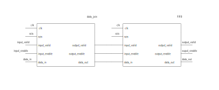

8 位输入 4 位输出的连接方法：

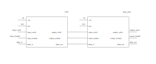

根据实验要求，DMA 模块有两个数据传输方向（从 MEM 到 CPU 和从 CPU 到 MEM），同时缓冲区有两种工作状态（BUF1 输入且 BUF2 输出、BUF1 输出且 BUF2 输入）。这样组合起来，DMA 模块总共有 4 种工作状态，我们分别考虑不同工作状态下的电路设计：

从 MEM 到 CPU (BUF1 输入且 BUF2 输出、BUF1 输出且 BUF2 输入)

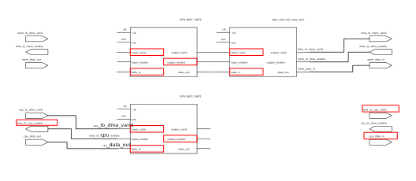

从 CPU 到 MEM（BUF1 输入且 BUF2 输出、BUF1 输出且 BUF2 输入）

注意到不同传输方向和缓冲区状态下，使用的模块基本相同，仅信号连接不同。总共使用了 2 个 `FIFO` 模块（`BUF1`、`BUF2`）、1 个 `data_split` 模块（`obj_data_split`）、1 个 `data_join` 模块（`obj_data_join`）。

我们将数据传输方向和缓冲区状态各用一个寄存器保存，利用数据选择器（组合逻辑电路）根据工作状态切换信号连接。数据选择器（组合逻辑电路）通过 `always @(*)` 和 `case` 语句实现，以增强可读性。需要注意的是，数据选择器始终是多路输入、一路输出，故只需要对中间模块的输入和 DMA 模块的输出使用 `reg` 类型变量并使用 `always @(*)` 语句块赋值，需要使用数据选择器的信号已经在上面两图中用红色圈出。

模块通过 `direction_control` 信号控制数据传输方向。通过时序逻辑电路，复位时将 `direction_control` 信号写入寄存器 `direction` 中。

两个缓冲区一个读空另一个写满时，DMA 模块既不能写入，也不能读出，即控制信号满足 `!dma_to_cpu_valid && !dma_to_cpu_enable && !dma_to_mem_enable && !dma_to_mem_valid`。根据设计要求，通过时序逻辑电路，在此时切换两个缓冲区的工作状态。

### FIFO 模块
> 设计文件：`/sources/FIFO.v`

此模块为一个输入输出侧均为 8 位宽的同步 FIFO 模块。模块只存在两种工作状态（只输入不输出、只输出不输入），当队列写满或读空时交换工作状态。
#### 接口定义
* `clk`：输入，时钟信号，上升沿有效。
* `rstn`：输入，异步复位信号，下降沿有效。
* `input_valid`：输入，传入 FIFO 的数据是否有效。
* `input_enable`：输出，FIFO 是否准备好接收数据。
* `data_in`：8 位宽输入，传入 FIFO 的数据。
* `output_enable`：输入，下一器件是否准备好接收数据。
* `output_valid`：输出，FIFO 传出的数据是否有效。
* `data_out`：8 位宽输出，FIFO 传出的数据。

#### 模块原理
模块维护了一个寄存器 `state`，用于描述当前 `FIFO` 模块的工作状态（只读 `READ`、只写 `WRITE`）。`input_enable` 和 `output_valid` 由 `state` 决定。当模块处于读状态（`state == READ`）时，`output_valid` 为真，否则为假；当模块处于读状态（`state == WRITE`）时，`input_enable` 为真，否则为假。

模块维护了两个指针：读指针（`read_p`）和写指针（`write_p`），读指针始终指向队首元素，写指针始终指向队尾元素的后一个空位。在时钟上升沿到来时，若 `input_enable` 和 `input_valid` 同时为真，写指针向后移动一位；若 `output_enable` 和 `output_valid` 同时为真，读指针向后移动一位。

在时钟上升沿到来时，若`input_enable` 和 `input_valid` 同时为真，则将输入数据 `data_in` 写入写指针 `write_p` 指向的寄存器空间。

通过组合逻辑电路（数据选择器），输出数据 `data_out` 始终指向读指针 `read_p` 指向的寄存器空间。

### data_join 模块
> 设计文件：`/sources/data_join.v`

此模块用于将串行的两个 4 位宽数据拼接成一个 8 位宽数据。接口定义与 `FIFO` 模块相同。其是否准备好接收数据完全由下级器件决定。
#### 接口定义
* `clk`：输入，时钟信号，上升沿有效。
* `rstn`：输入，异步复位信号，下降沿有效。
* `input_valid`：输入，传入的数据是否有效。
* `input_enable`：输出，是否准备好接收数据。
* `data_in`：8 位宽输入，传入的数据。
* `output_enable`：输入，下一器件是否准备好接收数据。
* `output_valid`：输出，传出的数据是否有效。
* `data_out`：8 位宽输出，传出的数据。

#### 模块原理
该模块维护了一个指针 `cnt` 和一个 8 位宽的缓冲区 `buffer`。`cnt` 实际为一个计数器，在时钟上升沿到来时，若 `input_enable` 和 `input_valid` 同时为真，其值加一（若当前已经是最大值，则归零）。

在时钟上升沿到来时，若 `input_enable` 和 `input_valid` 同时为真，则将输入数据 `data_in` 写入 `cnt` 指向的 4 位寄存器空间。

输出数据 `data_out` 直接指向缓冲区 `buffer`。

在时钟上升沿到来时，若 `input_enable` 和 `input_valid` 同时为真，且 `cnt` 已经是最大值，则意味着下一个时钟上升沿到来时，数据已经拼接完成，于是把`data_ready` 置为真；若数据已经拼接完成（`data_ready` 为真）且下一器件座号接受数据准备（`output_enable` 为真），则意味者下一个时钟周期到来时，当前拼接完成的数据已经被取走，于是把 `data_ready` 置为假。`output_valid` 的值由 `data_ready` 控制。

其是否准备好接收数据（`input_enable`）完全由下级器件决定（`output_enable`）。

### data_split 模块
> 设计文件：`/sources/data_split.v`

此模块用于将一个 8 位宽数据分割成串行的两个 4 位宽数据。接口定义与 `FIFO` 模块相同。其输出数据是否有效完全由上级器件决定。
#### 接口定义
* `clk`：输入，时钟信号，上升沿有效。
* `rstn`：输入，异步复位信号，下降沿有效。
* `input_valid`：输入，传入的数据是否有效。
* `input_enable`：输出，是否准备好接收数据。
* `data_in`：8 位宽输入，传入的数据。
* `output_enable`：输入，下一器件是否准备好接收数据。
* `output_valid`：输出，传出的数据是否有效。
* `data_out`：8 位宽输出，传出的数据。

#### 模块原理
该模块实际是一个计数器和数据选择器的组合。指针 `cnt` 为一个计数器，在时钟上升沿到来时，若 `output_enable` 和 `output_valid` 同时为真，其值加一（若当前已经是最大值，则归零）。

通过组合逻辑电路（数据选择器），输出数据 `data_out` 始终指向输入数据 `data_in` 的第 `cnt` 个 4 位宽数据。

若 `output_enable` 和 `output_valid` 同时为真，且 `cnt` 已经是最大值，则意味着输入数据 `data_in` 的各个部分已经被全部取走，已经准备好接受下一个数据，那么 `input_enable` 的值为真；否则，意味着要么当前输入数据还没有被读完，要么输入数据不有效，`input_enable` 的值为假。

其输出数据是否有效 `output_valid` 完全由上级器件 `input_valid` 决定。

## 行为仿真测试
> 测试文件：`/sources/test_DMA.v`

行为波形仿真图如下：

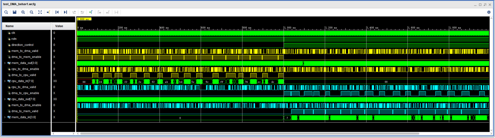

测试包括两个部分，前半部分（0~1000ns）测试从 MEM 向 CPU 传输数据，后半部分（1000ns~2000ns）测试从 CPU 向 MEM 传输数据。两部分开始时均对 DMA 模块进行一次复位。仿真的时间足够长，以保证 BUF1 写入 BUF2 读取、BUF1 读取 BUF2 写入两个状态均有充分的测试。

为了方便追踪，测试使用了一个计数器 `counter` 用于记录当前的时钟周期数，每遇到时钟上升沿加一，复位时置为 0。

根据实验要求，`mem_to_dma_valid`、`mem_to_dma_enable`、`cpu_to_dma_valid`、`cpu_to_dma_enable` 这四个外部信号位在时钟`clk`上升沿由系统任务 `$random()` 随机产生。MEM 的输出数据 `mem_data_out` 和 CPU 的输出数据 `cpu_data_out` 也随时钟上升沿由系统任务 `$random()` 随机产生。随机产生的信号有助于验证模块的鲁棒性。

由于控制信号是随机产生的，波形文件的可读性并不好。实验要求只有当 `valid` 和 `enable` 同时为高的时候，DMA才进行数据的传输工作。在时钟的上升沿，若对应的 `valid` 和 `enable` 同时为真，则将对应的 `data` 信号分别写入文件 `mem_in_queue.log`、`mem_out_queue.log`、`cpu_in_queue.log`、`cpu_out_queue.log`。为了方便追踪，在输出时同时输出了当前的时钟周期数（`counter` 的值）。复位时也将复位信号写入这 4 个文件。

通过观察比对输出得到的 4 个 `*.log` 文件，可以认为 DMA 的数据传输功能是正常的。

下面是放大的行为仿真波形图，可以观察到 DMA 工作符合设计要求。

以下 6 张图片是 MEM TO CPU 方向的测试：

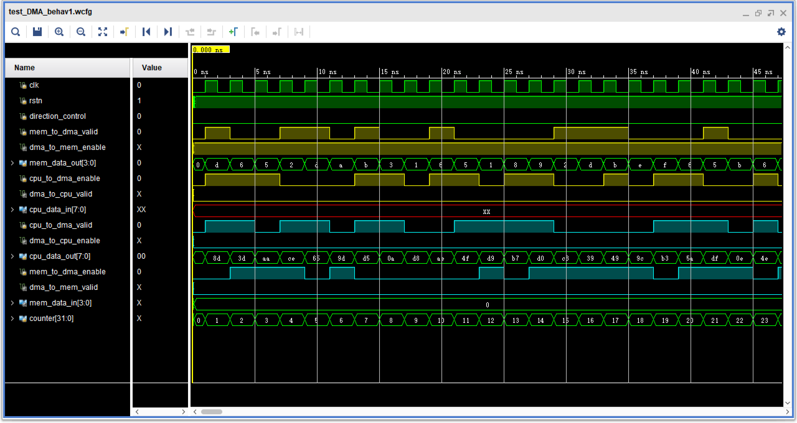
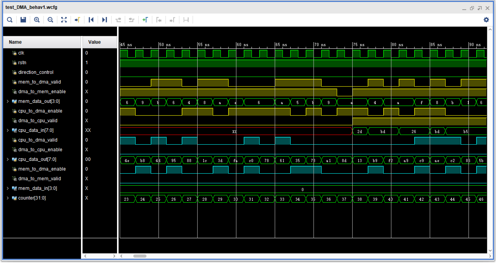
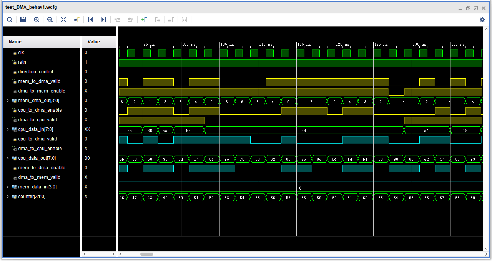
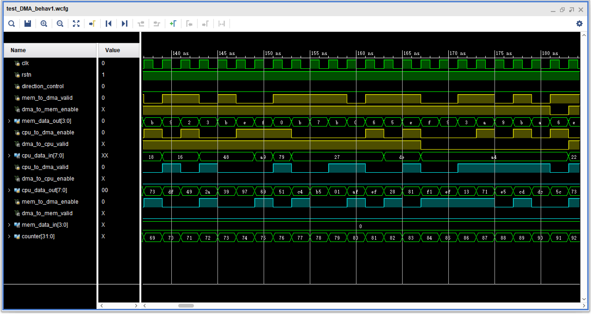
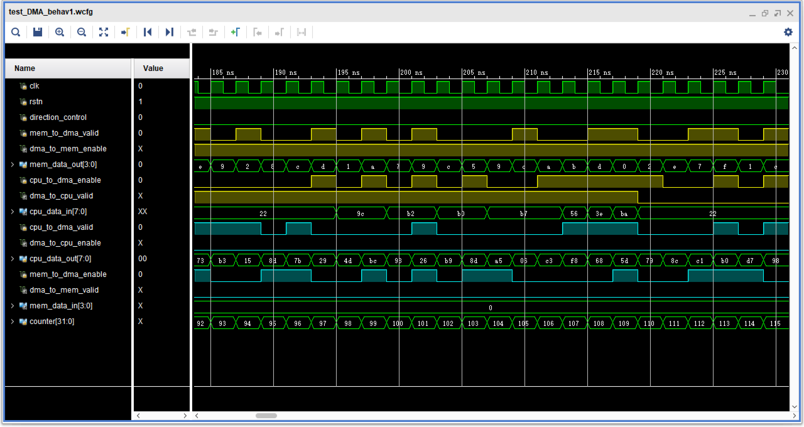
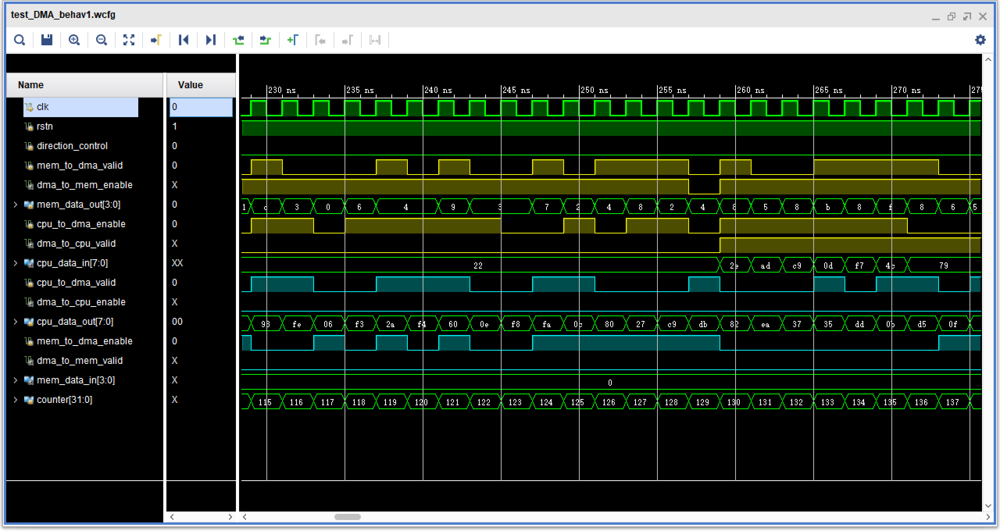

以下 6 张图片是 CPU TO MEM 方向的测试：

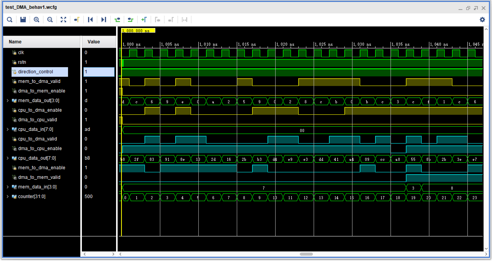
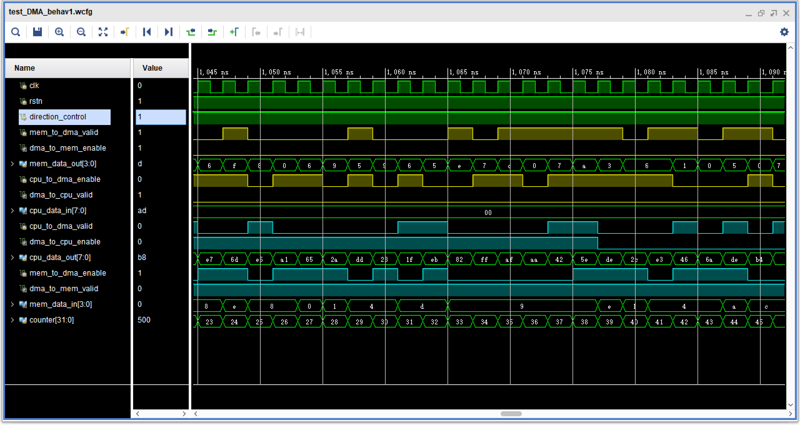
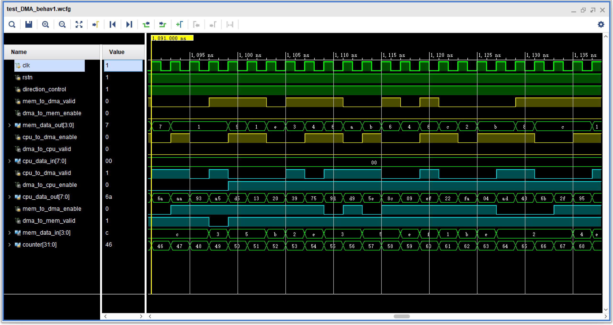
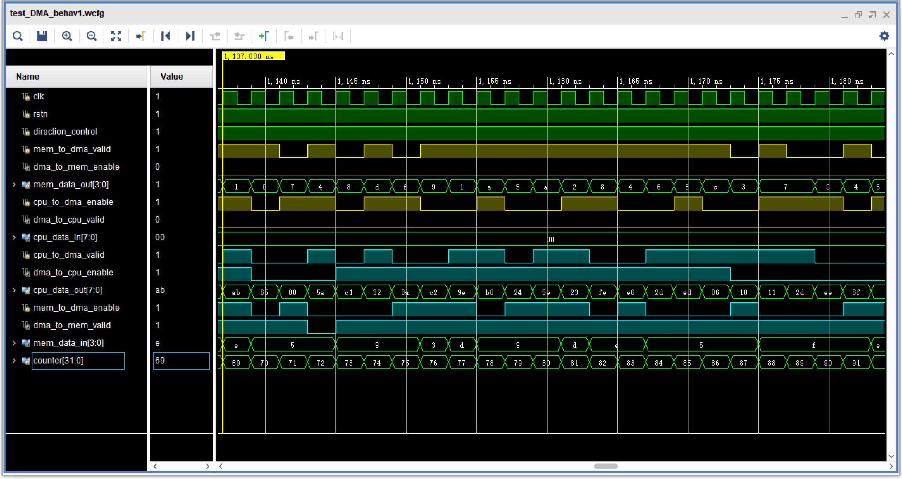
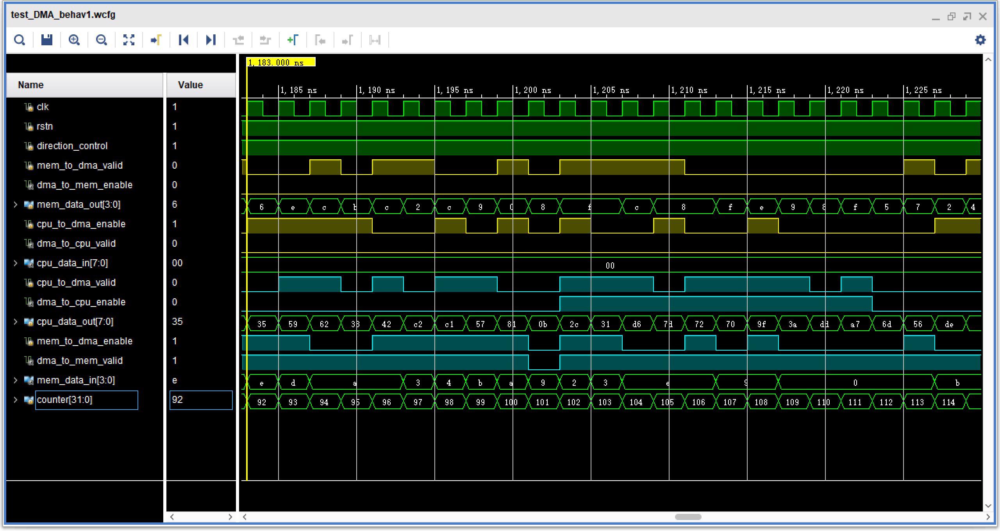
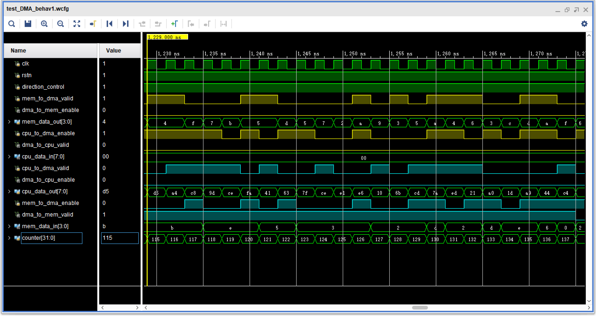

## 项目的创新与特色
与之前完成的 FIFO 实验不同，在这次编写 DMA 的实验中，我基本摆脱了程序设计语言的编写风格，代码风格（应该）更贴近硬件描述语言。在编写代码的时候，心中基本有了电路。电路清晰地区分了组合逻辑电路和时序逻辑电路，保证在一个 `always` 块与 `reg` 类型的变量一一对应。

在 `FIFO`、`data_join`、`data_split` 三个模块中，使用了“参数例化”语法，以适应不同的位宽需求，并提升了可读性。（实际上只使用了默认参数）

在表示 DMA 模块的状态时，使用了数个 parameter 来表示当前状态，使用位拼接运算符 `{}` 将两个状态拼接在一起进行判断，提高了程序的可读性。

在这个 DMA 模块中，没有按之前实现 FIFO 的方式在 FIFO 内部处理位宽不同的数据，而是使用两个外部模块进行处理。

通过组合逻辑电路实现数据选择器，以此切换电路的连接方式。

## 参考文献
* [verilog语法-001参数例化](https://blog.csdn.net/icxiaoge/article/details/84072911) - https://blog.csdn.net/icxiaoge/article/details/84072911
* [verilog语法-004 比特位选择](https://blog.csdn.net/icxiaoge/article/details/85224538) - https://blog.csdn.net/icxiaoge/article/details/85224538
* [FIFO读写侧位数不同的处理](https://blog.csdn.net/emperor_strange/article/details/88975030) - https://blog.csdn.net/emperor_strange/article/details/88975030
* [【FPGA——基础篇】同步FIFO与异步FIFO——Verilog实现](https://blog.csdn.net/Lily_9/article/details/89326204) - https://blog.csdn.net/Lily_9/article/details/89326204
* [verilog通过中+：与-：解决变量内固定长度数据位的动态选取](https://blog.csdn.net/mangyegulang/article/details/55106898) - https://blog.csdn.net/mangyegulang/article/details/55106898
>（面向 CSDN 的编程）